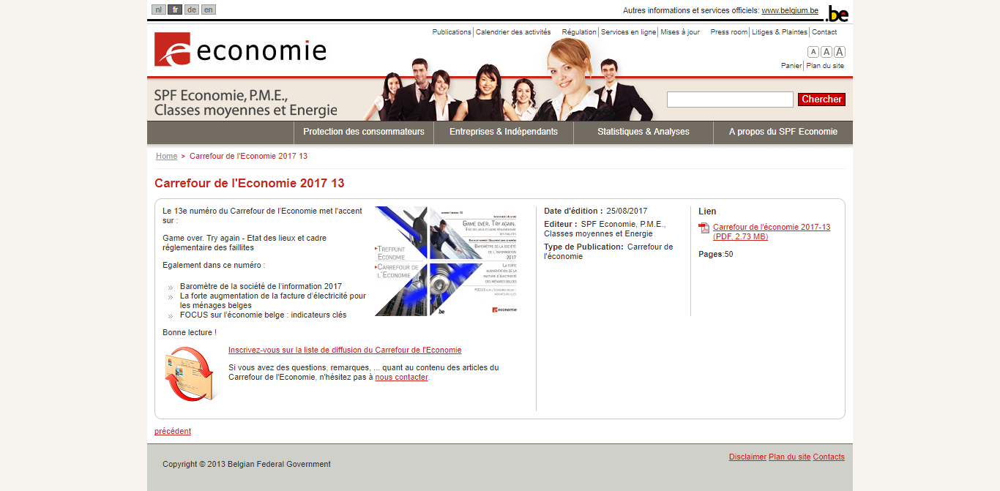

## Valorisation *Web* d'une étude E4 récente

### "*Game Over*. *Try It Again*". &Eacute;tat des lieux et cadre réglementaire des faillites.

Une [étude][1] consacrée aux faillites est parue le 25.08.2017 dans le numéro 13 de la revue "*Carrefour de l'&Eacute;conomie*".

<iframe title="Test" src="http://economie.fgov.be/fr/binaries/Carrefour_economie_2017_13_tcm326-284157.pdf" width="600px" height="400px"></iframe>

> La couverture du numéro 13 de *Carrefour de l'&Eacute;conomie* illustre cette étude.  
> L'étude en elle-même va de la page 16 à la page 28 (**13 pages**)  
> Elle est suivie d'une page de bibliographie (page 29) et de trois pages de notes explicatives (pages 30 à 32)

> Les autres études du numéro 13 sont :  
> * **E3** : "Baromètre de la société de l'information 2017" (pages 2 à 14 - notes en page 15) ;  
> * **E4** : "La forte augmentation de la facture d'électricité des ménages belges" (pages 33 à 47 - notes en pages 48 à 51) ;  
> * **E4** : "Focus sur l'économie belge : indicateurs clé (analyse clôturée au 16 juin 2017)" (pages 52 à 56)

[][2]

> Depuis sa relance en 2013, *Carrefour de l'&Eacute;conomie* n'est plus disponible en format "papier", sauf commande auprès de l'*Infoshop*.  
> <strong>Actualité récente</strong> : l'*Infoshop* ferme ses portes le 29.09.2017, de sorte que plus aucune communication ne sera faite au public quant à la possibilité de commander des tirages "papier" de la revue *Carrefour de l'&Eacute;conomie*.

Aucun communiqué de presse n'a été produit à l'occasion de la sortie du numéro 13 de *Carrefour de l'&Eacute;conomie*.

> Le numéro 13 a été mis en ligne le 25.08.2017.  
> Trois jours auparavant (22.08.2017), E8 publiait pourtant un communiqué de presse relatif aux faillites du mois de juillet 2017.  
> Le [**communiqué de presse de E8**](http://economie.fgov.be/fr/modules/pressrelease/statistiques/economie/3_1_3_4_1_statistiques_des_faillites_2017_07.jsp) ne référait pourtant pas à la publication imminente d'un *focus* sur les faillites dans le cadre du numéro 13 de *Carrefour de l'&Eacute;conomie*.  

[1]: http://economie.fgov.be/fr/binaries/Carrefour_economie_2017_13_tcm326-284157.pdf
[2]: http://economie.fgov.be/fr/modules/publications/carrefour/carrefour_2017-13.jsp