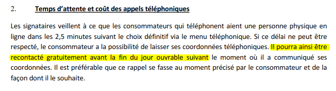

## Ce que prévoit la "*Charte Clients*"

La "*Charte Clients*" figure sur le site depuis le **22.10.2012** à la page :  
[http://economie.fgov.be/fr/binaries/charte_en_faveur_de_la_clientele_20121022_tcm326-156986.pdf](http://economie.fgov.be/fr/binaries/charte_en_faveur_de_la_clientele_20121022_tcm326-156986.pdf)

&Agrave; la page 2/13, on peut lire ce qui suit :

Ceci implique :

* en cas de présence d'un agent : il doit décrocher dans les 150 secondes.
* en cas de non prise de l'appel : le client peut laisser ses coordonnées.
* si le client a laissé ses coordonnées : l'agent doit le recontacter avant la fin du lendemain ouvrable.

