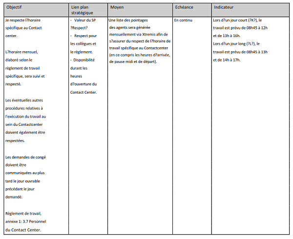

## Juxtaposition des positions

### Stan Holvoet (chef fonctionnel)

### Bernard Dupont (évalué)

----

### Deuxième contestation

L’évalué n’a pas caché, au cours d’un contact informel mené le 05.05.2017, qu’il s’oppose par principe à l’objectif « sanction » relatif au non-respect du règlement de travail.  
Il s’engage à faire des efforts pour arriver à 8h45, mais ne saurait en aucun cas être tenu pour responsable des retards des transports en commun dus à la congestion et aux travaux et chantiers en Région de Bruxelles-Capitale.  
Il rappelle que, depuis le 01.07.2006, tous les agents du SPF bénéficient de cinq journées de compensation pour, notamment, pallier les conséquences néfastes pour eux et pour leur santé (stress) des dits retards chroniques.