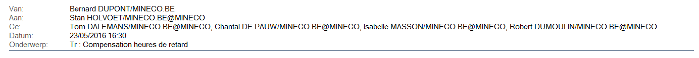

## Quelle est la "prestation théorique" ?

> **Annexe 1 du Règlement de travail :**  
> *2.2.4. <u>Insuffisance d’heures</u> L'insuffisance (débit) de prestations cumulées en fin de mois ne pourra être supérieure à 12 heures par rapport à la <u><b>prestation théorique</b></u>. On ne peut pas être continuellement en débit d’heures. Tout débit doit être compensé endéans un délai de deux mois.*

### Pour les agents bénéficiant de l'horaire flexible

* 7 h 36 par jour
* 0 h 30 de pause méridienne forfaitaire
* soit **8 h 06 de présence**

<table border="1">
<tr>
<td>les relevés <i>XTremis</i> montreraient une insuffisance d'heures si celle-ci était de 12h par rapport à 8h06 de présence journalière</td>
</tr>
</table>

### Pour les agents bénéficiant du Contact Center

* pendant deux jours :  7 h 15 par jour (de 8 h 45 à 16 h 00)
* est incluse dans cette période 1 h 00 de pause méridienne
* soit **7 h 15 de présence**

* pendant deux jours :  8 h 15 par jour (de 8 h 45 à 17 h 00)
* est incluse dans cette période 1 h 00 de pause méridienne
* soit **8 h 15 de présence**

En moyenne, la présence théorique est de **7 h 45 de présence**

<table border="1">
<tr>
<td>les relevés <i>XTremis</i> montreraient une insuffisance d'heures si celle-ci était de 12h par rapport à 7h45 de présence journalière</td>
</tr>
</table>

### Position de l'évalué (courriel du 23.05.2016)

Bonjour Stan,

Je m'étonne du contenu de ton courriel.  
En effet, nous avions convenu toi et moi, à l'occasion de l'entretien de planification (= rendez-vous permettant de fixer les bases de mon évaluation en 2016) ce qui suit :  
(...)  
L'évalué (...)  peut également démontrer qu'<u><b>il demeure quasi quotidiennement à la disposition du citoyen bien au-delà (plus d'une demi-heure en moyenne par jour) de l'heure limite nominale du régime de travail</b></u> lui accordé par le § 3.7 de l'Annexe 1 du Règlement de Travail du SPF Economie.  
Il rappelle enfin que ledit § 3.7 prévoit que “Les membres du Contact Center ne peuvent pas récupérer d'heures supplémentaires” et qu'en conséquence, les prestations de l'évalué au service du client dépassent sensiblement depuis de nombreuses années la durée du temps de travail auquel il est soumis en vertu du Règlement de Travail. (...)
L'évalué (...) relève surtout non sans perplexité que l'article 3 de l'AR du 24.09.2013 prévoit que “l'évaluation se fonde principalement sur la réalisation des objectifs de prestation fixés lors l'entretien de planification et éventuellement adaptés lors des entretiens de fonctionnement”, de sorte que l'évalué ne voit vraiment pas en quoi la consultation d'un enregistrement de ses temps de présence au travail ait été ou serait à l'avenir de nature à influencer le jugement porté par son évaluateur sur ses efforts pour réaliser les objectifs de prestation vers lesquels il tend au quotidien.

Ta signature électronique témoigne de ton accord avec l'intégralité de ce qui précède.  
Par ailleurs, le fichier Excel relatif au mois d'avril que tu m'as transmis ne correspond nullement avec mes heures de prestation, en ce sens que ma durée totale de présence et mes heures de mes sorties n'y figurent pas du tout.  

Or, après vérifications de mon XTremis pour avril avec mon délégué syndical, il apparaît que mon déficit ne doit pas du tout être compensé.  

* Je ne suis en effet <u>arrivé que 21' au total après 9h00</u>, qui est l'heure d'ouverture au public du Contact Center figurant sur le site internet du Département.
* Je ne suis <u>parti du bureau que 24' au total avant l'heure légale de fermeture</u> du Contact Center.
J'ai systématiquement eu un <u><b>temps de présence d'au moins 38' supérieur par jour aux 7h15 ou 8h15</b></u> correspondant à mon régime de travail.

Je refuse dès lors ta proposition.

Si souhaité, mon délégué syndical, M. Dumoulin, se tiendra à ton entière disposition dans l'hypothèse où tu douterais des résultats susmentionnés de la confrontation de mon relevé XTremis avec ton relevé Excel de mes seules heures d'arrivée. Surtout, il m'assure de son plein soutien dès lors qu'il s'agirait de t'expliquer la raison d'être des dispositions de l'article 3.7 de l'Annexe 1 du Règlement de Travail qu'il a négociées en 2013 en faveur du bien-être au travail (lutte contre le stress et le burn out) du personnel du Contact Center, dont tu n'as malheureusement pas pu connaître la genèse.

Bernard DUPONT.
