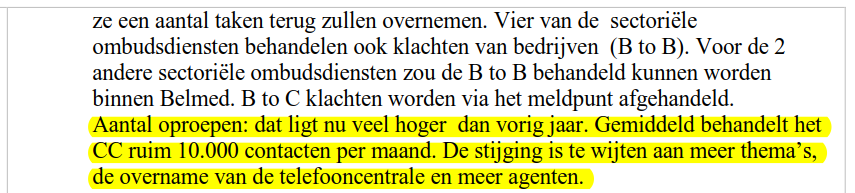

## Estimation de la charge collective de travail

| Extrait du PV de la réunion de service du 03.05.2016 |
| --- |
|  |

* Nombre de jours ouvrés par mois : **20** (parfois 23, mais existence de jours fériés)

=&gt; nombre de contacts par jour = environ 500.

* Nombre d'heures d'ouverture au public : **8** (de 09h à 17h - voir site)

=&gt; nombre de contacts par heure = environ <b>60</b>.

