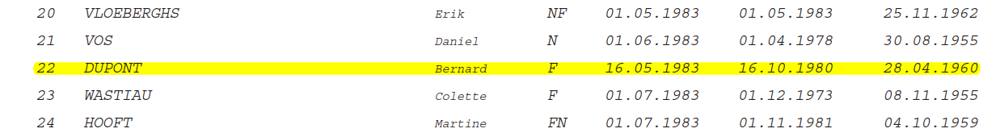
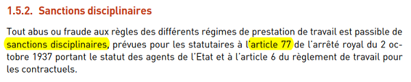

## Médiation &Eacute;valuation/Contact Center

## Ancienneté

  
<u>de g. à dr. :</u> ancienneté de grade - ancienneté de service - date de naissance

### Antécédents

* * [**03.09.2009**](Werking_Contactcenter_20090903.pdf) - Proposition d'un horaire destiné à **<u>attirer</u>** le personnel Focus sur la [**raison d'être**](Adaptation_Horaire.md) de la proposition
* L'analyse de risques du [**16.09.2010**](Risicoanalyse_20100916.pdf) met en évidence : "*<u>CONFORMITEIT</u> de agenten cc beschikken over een zekere vrijheid bij de vooral telefonische dienstverlening.*"

### Respect des valeurs et des règles impératives

* <b>Les (eventuels) abus <i>XTremis</i> relèvent du disciplinaire</b> - et non de l'évaluation - voir [art. 1.5.2 de l'Annexe 1]() du Règlement de Travail  &nbsp;
* **Respect** : [Circulaire n°573](Valeurs.md) du 17.08.2007 relative au cadre déontologique des agents de la fonction publique administrative fédérale. - Diverses [**menaces**](Menaces.md) et/ou tentatives d'intimidation ont été faites contre l'évalué 
* **Risques psycho-sociaux** : l'évalué a sensibilisé son évaluateur et Mme De Pauw surles risques de *burn-out* lors d'une réunion le 26.05.2016 - Il lui semblait qu'il en avait été tenu acte le [**15.07.2016**](Mail_TDalemans_20160715.png)
* **Dossier d'évaluation** :  des documents peuvent être insérés par l'évalué en vertu de l'[art. 21 de l'AR &Eacute;valuation](Art_21_KB_Eval.png)
* **Objectifs SMART** : où &lt;**A**&gt; = [Acceptable](SMART.md) dans les conditions définies par la "Brochure du SPF P&O pour les collaborateurs"
* **Habitudes de la clientèle** : fréquentations en temps réel du site au [**07.06.2017**](https://bobjr-1.github.io/Temp/Mediation_CC/Frequentations_20170607.html).
* **Respect du Point 2.2.4 de l'Annexe 1 du Règlement de Travail** : celui-ci est d'aplication pour tous les agents, qu'ils bénéficient (ou non) de l'horaire flexible ou d'un régime particulier, prévoit : "*2.2.4. <u>Insuffisance d’heures</u> L'insuffisance (débit) de prestations cumulées en fin de mois ne pourra être supérieure à 12 heures par rapport à la [**prestation théorique**](Prestation_theorique.md). On ne peut pas être continuellement en débit d’heures. Tout débit doit être compensé endéans un délai de deux mois.*"

### Réunions de service

> **<u>NB :</u>** l'accès à ces réunions est limité à **1 personne** pour le *Contact Center*.

* Tentative de coup de force auprès de Mme De Pauw - Staff S4 du [**17.02.2015**](20150217.png)
* Réunions pendant l'[**exercice d'évaluation 2016**](RS_2016.md)
* Réunions pendant l'[**exercice d'évaluation 2017**](RS_2017.md)

## Comparaison des deux positions

* pour le cycle 2016
* [**pour le cycle 2017**](Positions_2017.md) - Le [**fondement**](Zoom.md) des propositions de compromis soumis par l'évalué le 02.06.2017

