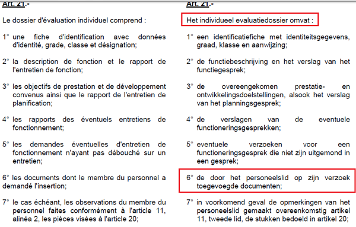

## Valeurs

### Respect

| Circulaire n° 573 relative au cadre déontologique des agents de la fonction publique administrative fédérale du 17.08.2007 |
| --- |
|  |
| [Texte complet de la Circulaire](Circ_20070817.pdf) |

### Droit d'accès de l'évalué à son dossier

| Article 21 de l'AR du 24.09.2013 relatif à l'évaluation |
| --- |
|  |

