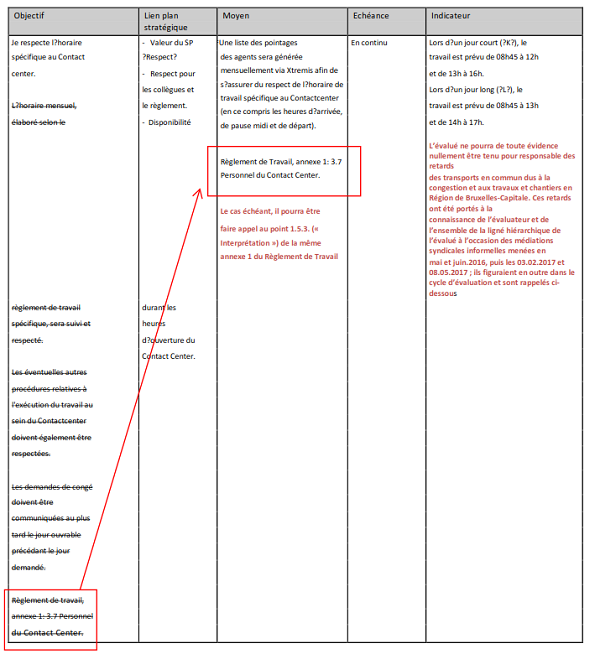

## Zoom sur la proposition de l'évalué

### [Zoom](Zoom.png)

### Que dit le Point 1.5.3. de l'Annexe 1 du Règlement de Travail ?

Le directeur Personnel et Organisation est le garant de l’application correcte et uniforme du présent règlement. 

A cette fin, il est seul compétent pour interpréter le présent règlement. Toutes les demandes d’interprétation ou de dérogation lui sont communiquées. Dans ce cadre, il tient compte de l’avis éventuel du chef d’administration concerné ou de son délégué. 

Le directeur P&O reçoit les demandes d’interprétation qui portent sur des questions de principe ou sur des points non-prévus au présent règlement. Le directeur P & O se concerte avec le président du Comité de direction et prépare le dossier en vue de sa présentation à l’ordre du jour du Comité intermédiaire de concertation, dans le cadre des bonnes relations avec les organisations syndicales. 

