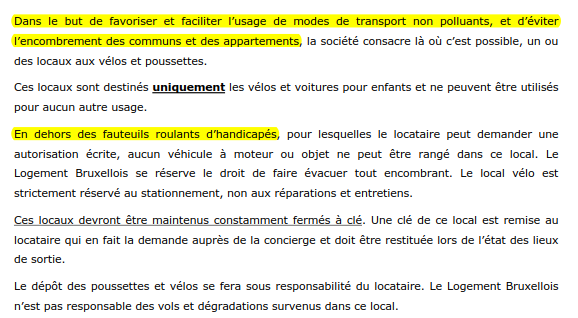

# Vers un nouvel article ("Facilités") ?

Pour préparer le *brainstorming*, une recherche a été effectuée sur les autres ROI découverts sur le web, ainsi que des ROI applicables aux locataires sociaux ([**retrouvez ici ces sources d'inspiration**](Sources.md))

| ROI | articles | thèmes concernés |
| :--- | :--- | :--- |
| [copropriété de Louvain-la-Neuve](ROI_LLN.pdf) | 4.01 (p. 2/4) | (...) Pour rappel, il existe un local vélo au niveau -1, accessible avec votre clé d’appartement. |
| [ROI du Foyer bruxellois (avant fusion)](ROI_Foyer_bxl_2010.pdf) | 14 (p. 12/19) | (...) Il est interdit aux enfants de jouer dans les parties communes de l’immeuble telles que couloirs, halls, ascenseurs, parkings, à l’exception des endroits prévus à cet effet (exemple : cour intérieure). (...)  |
| [ROI de LOREBRU (avant fusion)](ROI_Lorebru_2005.pdf) | 10 (p. 6/15) | Doivent être rangés dans les locaux "vélos" uniquement les poussettes et les vélos. Aucun véhicule à moteur ne peut donc être rangé dans ce local, sauf accord écrit de la Direction de Lorébru. Ces locaux devront être maintenus constamment fermés à clé (...) |
| [ROI de LOREBRU (avant fusion)](ROI_Lorebru_2005.pdf) | 15 (p. 8/15) | Il convient : - de ne pas faire de feu (...) - de ne pas faire de bruit ; - de respecter les plantations ; - de ne jeter ni papiers ni déchets ; - (...) ; par conséquent, les enfants (...) peuvent jouer dans les aires prévues à cet effet, afin d’éviter tout dérangement des résidents (...) |
| [ROI du Logement Bruxellois (en vigueur)](ROI_Logement_Bxl_2016.pdf) | 2 (p. 10/34) | (...) Ils doivent donc veiller à : - ne pas faire de feu car les fumées incommodent les voisins ; - ne pas faire trop de bruit, notamment en utilisant des radios ou des amplis ; - respecter les plantations ; - ne jeter ni papier ni déchet ni pain ni mégots ou cannettes. Les enfants des locataires peuvent jouer dans les aires prévues à cet effet mais doivent rester sous la surveillance des parents, qui veilleront à ce que les enfants ne perturbent pas le voisinage (...) |
| &nbsp; | &nbsp; | [ROI du Logement Bruxellois (en vigueur)](ROI_Logement_Bxl_2016.pdf) - art. 6 (p. 22/34)  |
