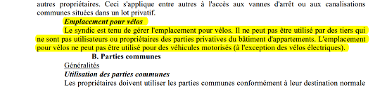

# *Inputs* en vue du *Drink* du 14.12.2017

## Travail sur les textes présentés le 30.11.2017

| Textes *martyrs* | Révisions |
| --- | --- |
| [Art. 03](Art_03_or.md) | [**en vue du 30.11**](Art_03.md) |
| [Art. 11](Art_11.md) | peut-on l'adopter pour le soumettre à l'AG 2018 ? |
| [**Art. 12**](Art_12.md) | <mark>&nbsp;&#x2B13; c'est un nouveau texte&nbsp;&#x2B12;</mark> |
| [Art. 13 et 21](Art_13_et_21_or.md) | [**en vue du 30.11**](Art_13_et_21.md) |
| [Art. 23](Art_23_3_or.md) | [**en vue du 30.11**](Art_23_3.md) | 

## Vers un nouvel article 10a ? <mark>(suite du <i>brainstorming</i> du 30.11.2017)</mark>

Un débat d'orientation a eu lieu à propos d'un éventuel nouvel article à propos des "facilités" mises à disposition des occupants, et dont l'usage doit être encadré, lors du [*Drink* du 30.11.2017](Drink_20171130.md).

L'emplacement de l'article (entre l'article 10 "*Parties communes*" et l'article 11 "*Tranquillité*") et le titre de l'article ("**Facilités**") ont semblé faire consensus.

En ce qui concerne un usage limité dans le temps des pelouses (par exemple, côté *Luther*) ou de la voie carrossable bordant l'immeuble (côté *Brabançonne*) pour les enfants, diverses objections ont été émises :

* qu'en est-il de la responsabilité ?
* que prévoir en cas d'accident ?
* que prévoir pour les enfants du voisinage (copains d'école) ?
* comment éviter que des dégradations n'apparaissent - voir des dépôts sauvages ?

Deux domaines (dont un qui est apparu lors du *Drink* du 30.11.2017) paraissaient pouvoir faire l'objet d'une proposition *martyre* :

1. une "facilité" pour les vélos (et la mobilité, en général) ;
2. une amélioration de l'accessibilité de l'immeuble aux moins valides et aux poussettes.

Voici cette proposition martyre :

### Exposé des motifs pour un nouvel article du ROI

L'Article **10** ("*Parties communes*") du Règlement d'ordre intérieur comporte, pour l'essentiel, des interdictions ou des limitations quant à l'usage des parties communes.

> L'objectif d'un nouvel article du ROI serait par contre de définir les `espaces de liberté` qu'autorise un usage bien compris de parties communes (= `communes` à tous les occupants) .

Le [**sondage de juin 2016**](Sondage_2016.pdf) réalisé auprès de tous les occupants a montré que de nouveaux besoins émergent progressivement, suite à l'évolution des modes de vie : les abords ne doivent pas être que décoratifs, les vélos devraient pouvoir être rangés en sécurité, etc.

On pourrait définir par exemple les modalités :  
* pour &#x2460; faciliter le stationnement et/ou le rangement pour les vélos ; de ce point de vue,
    * les [normes définies par Bruxelles-Environnement](http://www.environnement.brussels/le-permis-denvironnement/les-conditions-generales-dexploitation/les-obligations-en-matiere-de-1) autorisent diverses formules ;
        * lire en particulier la "*Fiche 1.10 : Le vélo et les autorisations d'urbanisme*" à la page 30/86 et 31/86 du [Vademecum Vélo de Bruxelles-Environnement](Vademecum_Velo.pdf) qui prévoit comme obligation du Règlement Général d'Urbanisme : "*dans les immeubles à logements multiples un emplacement vélo/voitures d’enfant par logement*" ;
    * la formule offerte par [*Cycloparking*](https://www.cycloparking.org/fr/parking-items/345-bx09-abdication.html) rue de l'Abdication (au coin de la rue Luther) consiste en la mise à disposition de 5 places pour 60 &euro; par an et une caution de 20 &euro; ;
        * il n'est pas certain à ce stade qu'une telle formule puisse être négociée par un syndic de copropriété : voir la [page d'information de *Cycloparking*](https://www.cycloparking.org/fr/%C3%A0-propos.html).
    * en ce qui concerne l'usage, une formule intéressante a été identifiée dans l'Acte de Base de la copropriété [Tivoli Green City - 1020 Bruxelles](Tivoli_Green_City_1020Bxl.pdf) ; il est proposé de s'inspirer de cette formule pour la rédaction du nouvel article **10a.1**, à savoir :  ;
* pour, de manière plus générale, &#x2461; faciliter l'accès de l'immeuble aux occupants, qu'ils soient moins valides ou en très bas âge (poussettes); de ce point de vue, 
    * l'asbl [Collectif Accessibilité Wallonie-Bruxelles](https://cawab.be/-Missions-.html) a été créée en 2006 pour représenter l’intérêt des personnes à mobilité réduite pour toutes les questions relatives à leur accessibilité ;
    * en particulier, elle a fourni un [Guide de 165 pages](CAWAB.pdf) qui devrait constituer une source d'inspiration pour les aménagements à instaurer progressivement par le Syndic afin d'améliorer l'accès à l'immeuble.

Il est donc proposé d'intituler cet article "**Facilités**, étant entendu qu'il appartient au Syndic, dans le cadre de ses responsabilité et pouvoirs ("*Le syndic est seul responsable de sa gestion ; il ne peut déléguer ses pouvoirs sans l'accord de l'assemblée générale et seulement pour une durée ou à des fins déterminées*" - art. 577-8 §5 du Code Civil) 

* de faire en sorte que l'installation, puis la maintenance de toute nouvelle facilité soit aisément gérable et n'entraîne pas de frais insupportables pour les copropriétaires ;
* de corriger les abus éventuels que le concierge ou lui-même constaterait.

### Projet de motion pour l'AG 2018

Il est proposé d'ajouter un nouvel article 10a du Règlement d'Ordre Intérieur (majorité simple) :

> Il est entendu que, si cet article est adopté, il deviendra l'article 11 du ROI et les (actuels) articles 11 et suivants seront renumérotés. 

**Art. 10a.1.** Le syndic est tenu de gérer l'emplacement pour vélos. Celui-ci ne pourra en aucun cas être utilisé par des tiers ne résidant pas à la "*Brabançonne*". Il ne pourra pas être utilisé pour des véhicules motorisés (à l'exception de vélos électriques). 

**Art. 10a.2.** Les accès de l'immeuble sont progressivement aménagés en fonction des recommandations de l'asbl CAWAB (Collectif Accessibilité Wallonie-Bruxelles) ; les occupants sont en retour invités à respecter ces aménagements.

**Art. 10a.3.** Il est rappelé que le syndic, seul responsable de sa gestion, se réserve la possibilité de préciser par avis déposé à l'entrée de l'immeuble ou par lettre personnalisée d'éventuelles modalités ou restrictions à l'usage des facilités évoquées dans le présent article.
