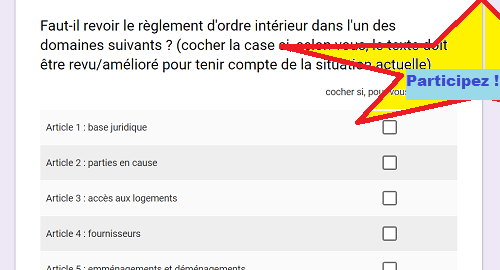

# Vers une mise à jour du ROI ?

### [**Répondez au sondage**](https://goo.gl/forms/fIdhrp0iJgdRNojq2) 

Le sondage est <mark><b>&nbsp;ouvert&nbsp;</b></mark>&nbsp;jusqu'au dernier *Drink* avant l'AG de 2018 <b>&nabla;</b> vous pouvez **sans limites** modifier vos réponses <b>&nabla;</b> vous pouvez **sans limites** ajouter vos suggestions &nbsp;

---

Au cours des *Drinks* qui nous séparent de l'Assemblée Générale statutaire de (en principe : première quinzaine de mars) 2018, et pour la première fois lors du *Drink* du 26.10.2017, il est proposé de réfléchir sereinement aux règles de vie commune de l'immeuble.

## Les articles soumis à révision

Ne feront d'objet de propositions à l'Assemblée Générale de 2018 que les articles sur lesquels nous nous serons mis d'accord.  
&Eacute;ventuellement, nous pourrions "créer" de nouveaux articles, si de nos *Drinks* ressort l'impression qu'un problème (une situation de vie) ou l'autre n'a jamais été "réglementé" depuis soixante ans par le ROI.

* [**Sources d'inspiration**](Sources.md) - sont recensés ici d'autres ROI découverts sur le web, ainsi que des ROI applicables aux locataires sociaux
* [**Résultats du sondage de 2016**](Sondage_2016.pdf) réalisé auprès des copropriétaires et des locataires &nbsp;
* Sujets évoqués lors des [**Drinks du printemps 2017**](Earlier_Drinks.md)
* Sujets abordés lors du [**Drink du 26.10.2017**](Drink_20171026.md)
* Sujets abordés lors du [**Drink du 30.11.2017**]() ce lien n'est pas encore activé
* Sujets abordés lors du [**Drink du 14.12.2017**]() ce lien n'est pas encore activé

## &Eacute;tat de la réflexion

| Vue panoramique |
| --- |
| `Cliquer sur l'image`  |

| Articles | &nbsp; |
| ---: | --- |
| [**Art. 03**](Art_03.md) | Faut-il préciser la notion d'`absence` ? - **[alerte *Twitter* du 25.11.2017](https://twitter.com/brab80webscom/status/934372196889309184)** |
| [**Art. 11**](Art_11.md) | Faut-il restructurer l'article ? - **[alerte *Twitter* (2) du 04.11.2017](https://twitter.com/brab80webscom/status/926913650195038219)** |
| [**Art. 13 & 21**](Art_13_et_21.md) | Plus de sécurité en sous-sol ? - **[alerte *Twitter* du 26.11.2017](https://twitter.com/brab80webscom/status/934704494880882688)** |
| [**Art. 23**](Art_23_3.md) | Faut-il ajouter un §3 ? - **[alerte *Twitter* (1) du 04.11.2017](https://twitter.com/brab80webscom/status/926798131005595648)** |

## Un peu de droit

Le règlement d'ordre intérieur (ROI) constitue une obligation légale depuis la loi du 08.07.1924. Le Code Civil a, certes, été revu dans les années '50, puis le 30.06.1994 et, pour la dernière fois, le 02.06.2010, mais il y a toujours été confirmé que **les copropriétés <u>doivent</u> être dotées d'un ROI**.

* Rappel de **[ce qu'exige précisément  le Législateur](Droit.md)** des copropriétés

Comme le ROI aborde un **champ potentiellement vaste** et vise à spécifier des droits et des obligations liés à des **situations juridiques très diverses** (copropriétaire &ne; locataire &ne; concierge &ne; fournisseurs &ne; visiteurs), le Législateur n'exige pas  que le ROI fasse l'object d'un acte notarié.

## Conséquences

Le ROI ne doit pas être déposé devant notaire. Cela a cinq conséquences.

1. Le ROI n'est **pas opposable** aux tiers.
> EXEMPLE PASS&Eacute; :  
cela signifie qu'on ne pouvait pas faire enlever par la police une voiture qui stationnait sur la voie carrossable, même si le ROI interdisait de s'y parquer.  
> DISPOSITION INENVISAGEABLE &Agrave; L'AVENIR :  
cela signifie aussi que, **même si l'AG devait voter une telle interdiction**, on ne pourrait pas interdire le dépôt de messages publicitaires dans toutes les boîtes ; les tiers ne sont en effet pas censés "obéir" au ROI de la Brabançonne ...

2. Le ROI est **modifiable s'il est admis que les conditions de vie en commun sont évolué** ; et comme le ROI n'est pas un texte "notarié", il est possible de le modifier :
    *  si de nouvelles situations apparaissent : par exemple, la construction au début du siècle d'un lieu de culte dans le voisinage ; ou 
    * si certains problèmes ne se posent plus du tout, ou plus dans les mêmes termes : par exemple, un [avis des pompiers](Avis_voie_carrossable.pdf) a éteint les débats infinis sur l'usage de la voie carrossable.

3. Comme le mandat du Syndic se limite à faire respecter les règles de vie, **le Syndic ne peut pas formuler de propositions de modifications du ROI** à l'Assemblée Générale ; c'est une saine application du principe de séparation des pouvoirs entre l'Exécutif (syndic) et le Législatif (AG).

4. Par contre, n'importe quel copropriétaire peut soumettre une proposition à l'Assemblée Générale. Il suffit de rédiger un point d'ordre du jour +/- comme suit :  
`A l'article # du ROI, il est proposé de remplacer la phrase "(...)" par "(...)" (vote à la majorité simple)` 

5. Modifier le ROI ne nécessite qu'un vote à la **majorité simple** (50% des quotités présentes ou représentées + 1 quotité) ; vu la structure de la "*Brabançonne*", il suffit donc d'obtenir l'accord du copropriétaire principal quant au **bon sens (et applicabilité pratique) de la proposition** de modification soumise au vote de l'AG.

## Références historiques

Vous trouverez ici les principales versions successives du ROI.

* [**Version originelle**](Version_1955.md) (1955)
* [**Révision d'il y a une dizaine d'années**](Version_2006.md) (2005-08)
* [**Retouches apportées suite au changement de syndic**](Version_2014.md) (2014)

