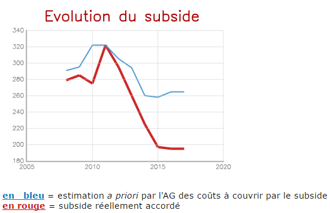

## Déclaration en vue de l'AG de l'asbl "Service Social"

Les commissaires aux comptes ont été avertis le 9 mars 2017 que la comptable avait vérifié les comptes 2016 et qu'ils pouvaient par conséquent en effectuer la vérification. Rendez-vous a été pris en ce sens pour le 23 mars 2017 avec Monsieur Conrad.
Ce jour là, les commissaires aux comptes Dumoulin et Verdin ont vérifié les points suivants :

* respect par les services comptables de la répartition indicative du budget de 195.000 &euro; adopté par l'AG du 26.05.2016 ;  
* correcte imputation de l'intervention pour l'assurance hospitalisation (144.125,49 &euro; en 2016) ;  
* enregistrement régulier, sans blanc ni interversion, des dépenses et recettes selon le plan comptable adopté par le conseil d'administration en 2010 ;  

Le contrôle par sondage des factures (achats sociaux, prêts sociaux, réception du subside), des extraits des comptes financiers et de la comptabilité n'a par ailleurs révélé aucune erreur.

En conséquence, les commissaires aux comptes ont signé un 
document d’approbation des comptes, sous réserve :

* de remarques ultérieures éventuelles à propos de la documentation mise à leur disposition ; celles-ci sont reflétées sous la rubrique "<b>Soutenabilité</b>" ci-dessous ;  
* du résultat éventuel d'échanges de vues menés entre commissaires aux comptes, puis avec Monsieur Renard, président du conseil d'administration.  

L'entrevue avec ce dernier a, en l'occurrence, eu lieu le [22] mai 2017.

## Soutenabilité

En avance de leur premier contrôle, les commissaires aux comptes avaient notamment reçu de Monsieur Conrad le document `Bilan ASBL schéma abrégé.pdf` ; à ce propos, il a été constaté que, sur les deux derniers exercices comptables, le compte de résultats présente les valeurs (arrondies à l'euro le plus proche) suivantes.

<table>
	<tr><th>Compte de résultat</th><th>2015</th><th>2016</th><th>Diff.</th></tr>
	<tr><td>Subside</td><td>197.000</td><td>195.000</td><td>-&nbsp;&nbsp;&nbsp;&nbsp;1%</td></tr>
	<tr><td>Ventes</td><td>135.644</td><td>&nbsp;&nbsp;&nbsp;&nbsp;&nbsp;&nbsp;&nbsp;467</td><td>-100%</td></tr>
	<tr><td><b>Total PRODUITS</b></td><td>332.644</td><td>195.467</td><td>-&nbsp;&nbsp;41%</td></tr>
	<tr><td>Achats et services</td><td>317.446</td><td>263.841</td><td>-&nbsp;&nbsp;17%</td></tr>
	<tr><td><b>Marge d'exploitation</b></td><td>&nbsp;&nbsp;15.198</td><td>-68.374</td></tr>
</table>

Il convient de noter que la marge d'exploitation en 2014 (constatée lors de l'approbation des comptes 2015 par l'AG du 26.05.2016) s'élevait à + 6.201,84 &euro;

<table>
	<tr><th>Compte de résultat</th><th>2015</th><th>2016</th><th>Diff.</th></tr>
	<tr><td>Marge d'exploitation</td><td>&nbsp;&nbsp;15.198</td><td>-68.374</td><td><b>-83.572</b></td></tr>
	<tr><td>Utilisation de provision</td><td>&nbsp;</td><td>&nbsp;&nbsp;20.000</td></tr>
	<tr><td>Résultat financiers</td><td>&nbsp;&nbsp;&nbsp;&nbsp;&nbsp;&nbsp;&nbsp;309</td><td>&nbsp;&nbsp;&nbsp;&nbsp;&nbsp;&nbsp;&nbsp;&nbsp;&nbsp;65</td></tr>
	<tr><td>Résultat exceptionnel</td><td>&nbsp;</td><td>&nbsp;</td></tr>
	<tr><td><b>Résultat de l'exercice</b></td><td>&nbsp;&nbsp;<b>15.507</b></td><td><b>-48.309</b></td><td>-63.816</td></tr>
</table>

Il convient de noter que le résultat de l'exercice 2014 (constaté lors de l'approbation des comptes 2015 par l'AG du 26.05.2016) s'élevait à + 7.470,82 &euro;

La question principale qui a dès lors été soumise <b><u>pour avis</u></b> à l'attention <b><u>des commissaires aux comptes</u></b> dès l'Assemblée Générale du 26.05.2016 a été formulée par Madame Parys, membre effectif, sous le point 4. de son ordre du jour.

> *"**Combien de temps pense-t-on encore <mark>&nbsp;vivre sur fonds propres&nbsp;</mark> ?**"*

Il convient de souligner que cette question portait sur la discussion d'un [**document de séance**](AG_2016_Budget_Question_FParys.pdf) dont le titre de la première rubrique était : <b>1 - Coûts estimés pour missions statutaires en partie couverts par la subvention</b>.

<u>&Agrave; noter :</u>  
Le total de cette rubrique, selon ce document, était de 264.750 &euro; ;  
le subside adopté par l'AG 2016 et sollicité auprès de l'Autorité n'était par contre que de 195.000 &euro;

Les Commissaires aux comptes ont retracé, à l'aide de la documentation mise à disposition, l'évolution de la rubrique `Coûts estimés pour missions statutaires en partie couverts par la subvention` depuis 2008 en la confrontant avec les montants des `subsides réellement accordés par l'Autorité`, ce, afin d'établir les part respectives :

* du fonctionnement sur subsides destinés à la réalisation *via* l'asbl des [**missions sociales de l'employeur**](AR_20130418.pdf) définies par l'AR du 18.04.2013 ;  
* du fonctionnement sur fonds propres de l'asbl (= patrimoine de départ + fonds affectés + résultats reportés + provisions), en raison de l'insuffisance de couverture par le subside de la mise en &oelig;uvre par le conseil d'administration et le personnel détaché des missions déléguées.

  
( vue sur le [**détail des chiffres**](https://bobjr-1.github.io/Temp/SSoc/Line_TPT.html) )

&Agrave; la suite de leur visite du 23.03.2017, les Commissaires aux comptes ont reçu de la part de Monsieur Conrad sa projection (calculée à un horizon de cinq années) des finances de l'asbl.  
Ils l'ont examinée et pris en compte pour estimer qu'un tel manque de couverture du subside, s'il devait se prolonger encore 3 ans, reviendrait à épuiser l'essentiel des réserves et provisions constituées antérieurement par l'asbl.

Il convient de souligner que ces réserves et provisions étaient le fruit :

* de la bonne gestion : comptes approuvés par l'AG et par le Ministre depuis 2009 ;  
* du respect scrupuleux de l'[**audit de 2006**](Audit_SSoc_2006.pdf) du SPF &Eacute;conomie, sous la direction de Mme Soetens et de M. Van Vaerenbergh.

> En particulier, cet audit notait que des réformes étaient nécessaires, dans la mesure où les comptes de l'asbl n'avaient pas été approuvés de 2003 (date de la réforme de la [législation sur les asbl](Loi_20020502_ASBL.pdf)) à 2008 inclus.  
> Quant à l'arrêté royal de 2013, négocié en Comité de Secteur IV dans la foulée de l'audit de 2006, il a fixé que les "*dépenses afférentes à la mise à disposition de i'ASBL des **moyens matériels nécessaires** sont **à charge du budget du SPF**&nbsp;*" (art. 9) pour autant que l'assemblée générale demande au conseil d'administration de lui présenter un rapport d'activité et un <mark>&nbsp;budget&nbsp;</mark> (art. 6 pt. 8°) <mark>&nbsp;de nature à assurer toutes les missions sociales&nbsp;</mark> déléguées à l'asbl par l'employeur.

Enfin, les Commissaires aux comptes ont pris connaissance du compte rendu du contact mené en novembre 2013 par Mme Devleeschouwer (vice-présidente du CA) et M. Dumoulin (administrateur, membre du Bureau du CA) avec Monsieur le Directeur "*B&amp;C*" Massant à propos des montants envisageables pour assurer une budgétisation structurellement saine de l'asbl et permettre à cette dernière d'assurer de manière pérenne les missions de l'[AR du 18.04.2013](AR_20130418.pdf).

> Un consensus avait alors été obtenu sur un budget de fonctionnement (= hors assurance hospitalisation) de l'ordre de 75.000 &euro; / 90.000 &euro; / 95.000 &euro; selon le nombre d'assistants sociaux mobilisables et la concrétisation (ou non) de synergies avec *Prorest* pour réduire les doubles emplois dans les opérations de *Catering*.

## Recommandations des Commissaires aux comptes

Mesdames et Messieurs les membres effectifs,

Arrivés au terme de la mission leur confiée par votre Assemblée Générale du 26.05.2016 et de leurs constatations à propos des budget, comptes, extraits financiers et justificatifs (factures, bons de commande, ordres de virement), les Commissaires aux comptes De Neve, Dumoulin et Verdin recommandent à votre Assemblée Générale statutaire 2017 de conclure :

* à l'approbation des comptes de l'exercice 2016 (01.01.2016-31.12.2016) ;  
* à l'approbation du bilan présenté par le conseil d'administration à la date du 31.12.2016 ;  
* à l'octroi de la décharge au conseil d'administration pour sa gestion de l'année 2016 ;  
* à donner mandat au conseil d'administration de solliciter de l'Autorité un montant de subside permettant <u>structurellement</u> de faire face aux missions qui ont été dévolues à l'asbl par l'[AR du 18.04.2013](AR_20130418.pdf) ;  
* à inviter les membres des délégations représentant les intérêts des travailleurs du SPF &Eacute;conomie à saisir pour ce faire le Comité de Secteur IV avec pour position commune un niveau de subside <u>structurel</u> de <mark>&nbsp;2xx.000 &euro;&nbsp;</mark> ; il va de soi que ce montant pourra, <u>conjoncturellement</u>, fluctuer autour de la valeur-pivot en question, en raison, par exemple, de l'évolution du coût de la vie, de celle de la pyramide d'âge du personnel, etc.

Les Commissaires aux comptes sont à votre disposition pour répondre à vos questions et sollicitent décharge.

Ils vous présentent, Mesdames et Messieurs les membres effectifs, leurs salutations et sentiments dévoués. 

<table>
<tr align="center">
<td width="150px"><b>Kim DE NEVE</b></td><td width="150px"><b>Robert DUMOULIN</b></td><td width="150px"><b>Julien VERDIN</b></td>
</tr>
<tr>
<td>&nbsp; &nbsp; &nbsp;</td><td>&nbsp;</td><td>&nbsp;</td>
</tr>
</table>